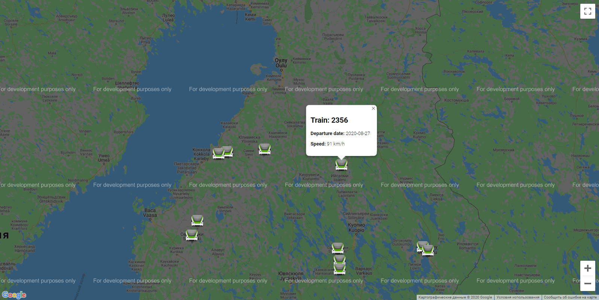
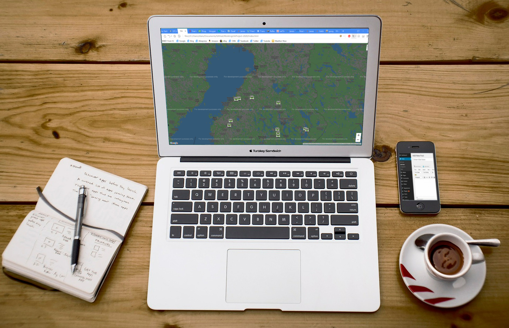

# WorkingLifeProject-2020

Train tracking  
This project is devloped to show train locations on the map and do some stuff with it's data we get from Datartafi api  
We used HTML, CSS, Javascript, Ajax  
During process of development we faced ceveral issues like adding markers and  it's info  

